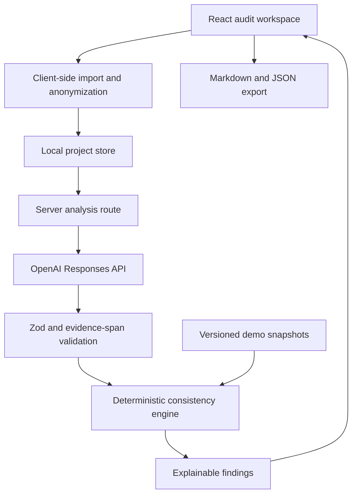

# 教师反馈一致性审计器：产品与技术设计文档

> 文档状态：Implementation-ready draft  
> 版本：0.1  
> 创建日期：2026-07-17  
> 目标赛事：OpenAI Build Week / Education 赛道  
> 工作名称：Teacher Feedback Consistency Auditor（仅为内部工作名称，提交前由作者确定最终名称）

## 1. 文档目的

本文档是后续开发、测试、演示和 Devpost 提交的单一设计依据。后续实现如与本文档产生冲突，应先在第 19 节“决策记录”中记录变更原因，再修改实现或本文档。

本项目不是自动评分器，也不替代教师。它是一个教师决策支持工具：分析同一项作业中的评分、文字反馈和作业证据，找出值得教师复核的不一致模式，并把最终决定留给教师。

## 2. 一句话定义

教师上传一份评分标准和多份匿名作业及现有反馈，系统通过可追溯的证据提取与确定性比较规则，找出“相似表现却得到明显不同评分或反馈”的情况，供教师逐项确认、驳回或修正。

## 3. 问题定义

### 3.1 目标用户

MVP 的主要用户是需要在短时间内批改同一项作业的中学或大学教师，尤其是使用多维 rubric 的写作类课程教师。

MVP 演示聚焦英文议论文作业，采用四个评分维度：

1. Claim and reasoning（论点与推理）
2. Evidence use（证据使用）
3. Organization（组织结构）
4. Language clarity（语言清晰度）

### 3.2 用户痛点

- 连续批改多份作业后，评分标准可能发生漂移。
- 相似错误可能得到不同严重程度的反馈。
- 某些 rubric 维度可能在部分学生反馈中被遗漏。
- 分数与文字反馈有时互相矛盾。
- 教师很难快速回看所有作业并进行横向校准。

### 3.3 产品承诺

产品只承诺：

- 找出值得复核的模式；
- 展示支撑该模式的原文、分数和反馈；
- 帮助教师高效完成横向校准；
- 保留教师的最终解释和决定记录。

产品不承诺：

- 判断教师是否“公平”；
- 自动决定学生应得分数；
- 自动修改成绩；
- 识别教师或学生的心理、能力、身份或受保护特征；
- 代替学校的正式申诉、评估或合规流程。

## 4. 成功标准

### 4.1 产品成功标准

MVP 必须让评委在无 API Key 的情况下完成以下完整流程：

1. 一键载入合成演示数据；
2. 查看评分标准、5 至 8 份匿名作业及教师反馈；
3. 运行或载入审计结果；
4. 在总览中看到需要复核的模式；
5. 打开某个发现，左右对照原文证据、分数与反馈；
6. 将发现标记为“确认”“驳回”或“已处理”；
7. 导出一份不包含真实个人信息的审计报告。

### 4.2 技术成功标准

- 演示数据模式完全离线可用，不依赖 API Key。
- Live Analysis 模式使用服务端 OpenAI API，不把 API Key 暴露给浏览器。
- 模型输出必须符合受版本控制的 JSON Schema。
- 一致性发现由确定性规则引擎产生，不能由一次自由文本模型调用直接决定。
- 每条发现至少关联一段源文本、一个 rubric 维度和一项教师评分或反馈。
- 已知合成数据的规则引擎结果可通过自动化测试重复验证。
- 原始学生文本不得进入应用日志。

### 4.3 Hackathon 成功标准

- 3 分钟以内的视频能完整覆盖问题、产品流程、技术实现、影响和差异化。
- README 明确记录 Codex 与 GPT-5.6 的具体使用方式和人类做出的关键决策。
- 仓库有清晰的一键运行说明和无需密钥的演示路径。
- `/feedback` Session ID 可在提交前填写。

## 5. 与评审 Rubric 的映射

### 5.1 Technological Implementation

对应设计：

- GPT-5.6 仅负责把非结构化作业与反馈转换成带证据位置的结构化 signals；
- TypeScript 规则引擎负责跨作业比较、阈值判断与 finding 生成；
- 使用 JSON Schema、运行记录、失败恢复、fixture 测试和明确的数据边界；
- 通过“模型提取 + 确定性审计”的混合架构避免单提示词包装器；
- 每条发现可追溯到输入文本和规则版本。

演示证据：

- 展示一条 finding 从原文到 signal 再到规则匹配的链路；
- 展示规则测试和一个失败/重试状态；
- README 中记录 Codex 参与架构、UI、测试和调试的具体提交。

### 5.2 Design

对应设计：

- 建立从创建项目、导入材料、隐私确认、运行分析到人工复核和导出的完整闭环；
- 发现详情页采用证据优先的左右对照，而不是只显示模型结论；
- 提供空状态、分析中、部分失败、无发现和无 API Key 等状态；
- 避免把学生直接标成红色“异常”，使用中性的“Review needed”语言；
- 英文 UI 作为 MVP 默认语言，以便评委直接测试。

### 5.3 Potential Impact

对应设计：

- 用户和场景明确：一名教师横向校准同一次作业的多份反馈；
- 输出直接嵌入教师已有的复核流程，而不是生成一份孤立报告；
- 可以测量处理一组作业所需时间、发现覆盖率和教师确认率；
- 使用合成但现实的案例展示“同类证据、不同评分”和“反馈遗漏维度”。

不得在没有真实测试证据时声称已经“节省 80% 时间”或“消除偏见”。提交材料只报告实际测得的数据。

### 5.4 Quality of the Idea

对应设计：

- 市面常见方案是自动评分或自动生成反馈，本项目审计教师已经完成的反馈；
- 核心创新是横向一致性校准、证据追溯和教师决策日志；
- 系统不把模型判断当成最终评分，而把模型能力限制在证据结构化环节；
- 可解释的 finding 能回答“为什么需要复核”，而不是只给一个模糊的一致性分数。

## 6. MVP 范围

### 6.1 必须完成（P0）

- 英文响应式 Web UI；
- 一键 Demo Dataset；
- 创建一个审计项目；
- 查看和编辑 assignment context；
- 查看和编辑 rubric dimensions；
- 导入或粘贴匿名学生作业、现有分数和反馈；
- 隐私确认步骤；
- 结构化 analysis signal 数据模型；
- 至少 4 类确定性一致性规则；
- 审计总览和 finding 过滤；
- finding 证据对照详情；
- 教师确认、驳回、已处理状态；
- Markdown 或 JSON 导出；
- 自动化规则测试；
- README 和演示说明。

### 6.2 应该完成（P1）

- 使用 OpenAI Responses API 的 Live Analysis；
- Structured Outputs；
- 分析进度和单份作业重试；
- 浏览器本地持久化教师决定；
- CSV 导入模板；
- 简单的审计运行统计；
- 可分享的只读演示部署。

### 6.3 本次不做（Non-goals）

- 学校账号体系、班级管理和角色权限；
- 与 Canvas、Google Classroom、Blackboard 等 LMS 集成；
- 真实学生姓名或学号处理；
- PDF、手写图片、DOCX 的完整生产级解析；
- 多次作业之间的长期教师表现比较；
- 自动写回成绩；
- 自动发送学生反馈；
- 统计意义上的公平性或歧视判定；
- 训练或微调专用模型；
- 付费、订阅、组织管理。

## 7. 核心用户旅程

```mermaid
flowchart LR
    A["Start demo or create audit"] --> B["Assignment and rubric"]
    B --> C["Import anonymized submissions"]
    C --> D["Privacy confirmation"]
    D --> E["Extract evidence signals"]
    E --> F["Run deterministic audit rules"]
    F --> G["Review dashboard"]
    G --> H["Inspect side-by-side evidence"]
    H --> I["Confirm, dismiss, or resolve"]
    I --> J["Export decision log"]
```



### 7.1 首次体验

首页只有两个主入口：

- `Try the demo`：载入内置合成数据和预计算 signals，无 API Key 也能运行；
- `Start a new audit`：创建自己的审计项目。

首页必须明确说明：

> This tool surfaces review signals. It does not grade students or change scores.

### 7.2 新建审计

步骤一：Assignment

- 作业标题；
- 年级或课程；
- 作业说明；
- 学习目标；
- 可选说明。

步骤二：Rubric

- 维度名称；
- 维度描述；
- 最高分；
- 可选等级描述。

步骤三：Submissions

每条记录包含：

- 匿名标识，如 `Student A`；
- 作业文本；
- 每个 rubric 维度的当前分数；
- 当前教师反馈。

步骤四：Privacy Check

- 确认数据已匿名化；
- Live Analysis 时明确说明文本会被发送给配置的模型服务；
- 默认不持久化原始文本到服务器；
- 未确认时不能开始 Live Analysis。

### 7.3 审计总览

总览不展示一个看似精确但难以解释的“教师公平分数”。展示以下可解释指标：

- `Open review signals`；
- `Rubric dimensions covered`；
- `Submissions analyzed`；
- `Signals by type`；
- `Teacher decisions`。

默认按严重程度和证据完整度排序。

### 7.4 Finding 详情

详情页面必须同时展示：

- finding 类型和中性解释；
- 触发规则及规则版本；
- 涉及的 rubric 维度；
- 涉及的两份或多份匿名作业；
- 原文证据片段；
- 当前分数；
- 当前教师反馈；
- “为什么值得复核”的规则化说明；
- `Confirm for review`、`Dismiss`、`Mark resolved`；
- 教师备注。

系统不得提供“一键修改全部分数”。

## 8. 审计规则

### 8.1 规则输入

规则引擎只读取已经验证过 schema 的数据：

- rubric dimension；
- 教师当前分数；
- 教师反馈；
- evidence signals；
- canonical issue tags；
- evidence excerpts；
- confidence；
- 可选 performance band。

规则引擎不读取模型的隐藏推理，不根据自然语言自由生成最终 finding。

### 8.2 P0 规则

#### R1：相似问题、评分差异明显

条件：

- 两份作业在同一 rubric dimension 下拥有相同 canonical issue tag；
- 严重程度相同或相邻；
- 教师分数差超过该维度满分的配置阈值；
- 两份 signal 都有原文证据。

输出：`SIMILAR_EVIDENCE_SCORE_GAP`

注意：它只表明“值得横向复核”，不表明哪一个分数正确。

#### R2：相似问题、反馈覆盖不一致

条件：

- 相同 canonical issue tag 出现在多份作业中；
- 一份反馈明确提及该问题，另一份反馈未提及；
- issue severity 达到配置阈值。

输出：`SIMILAR_ISSUE_FEEDBACK_OMISSION`

#### R3：分数与反馈语义冲突

条件示例：

- 分数处于最高等级，但反馈包含未解决的重大 rubric 问题；
- 分数处于最低等级，但反馈只包含明显正面判断且无改进说明。

输出：`SCORE_FEEDBACK_MISMATCH`

该规则必须使用显式等级阈值和受限 feedback stance 标签，不能直接进行开放式情绪判断。

#### R4：Rubric 维度未覆盖

条件：

- 作业在某维度有分数；
- 反馈没有对应维度标签；
- 该维度存在模型提取的 strength 或 issue signal。

输出：`RUBRIC_DIMENSION_NOT_ADDRESSED`

#### R5：反馈缺少可定位证据

条件：

- 反馈包含具体批评或表扬；
- analysis 无法在作业文本中找到支持该判断的 evidence span；
- 模型返回 `unsupported_or_unclear`，且置信度满足阈值。

输出：`FEEDBACK_WITHOUT_LOCATABLE_EVIDENCE`

R5 可以作为 P1；如果误报过高，则不进入默认演示。

### 8.3 Finding 严重程度

严重程度只代表复核优先级：

- `high`：评分差异大、重大问题遗漏或多个信号共同触发；
- `medium`：一个清晰的不一致模式；
- `low`：信息不足或轻微表达差异。

UI 文案必须避免使用 `biased`、`unfair`、`wrong` 等未经验证的标签。

## 9. 模型职责与提示边界

### 9.1 模型负责

- 将 rubric 转换成规范化维度；
- 从一份作业中抽取与维度有关的 strength、issue 和 unclear signals；
- 为每个 signal 返回可定位的原文片段；
- 将问题归一化到受控 canonical tags；
- 标记当前教师反馈覆盖了哪些维度和问题；
- 返回受限枚举中的 feedback stance 和 severity。

### 9.2 模型不负责

- 决定最终成绩；
- 判断教师是否公平；
- 修改教师反馈；
- 对学生能力或身份做推断；
- 直接决定哪条 finding 应显示；
- 生成无法追溯到原文的事实。

### 9.3 输出约束

Live Analysis 使用 OpenAI Responses API 和 Structured Outputs。输出必须满足 JSON Schema；应用应处理拒答、截断、超时和 schema 验证失败。

模型配置通过环境变量提供：

```text
OPENAI_API_KEY=...
OPENAI_MODEL=gpt-5.6
```

默认模型是显式比赛目标 `gpt-5.6`，但代码不得在多个位置硬编码模型字符串。实现时仍需根据账户可用性验证模型访问。

涉及学生文本的请求应设置 `store: false`。服务器日志只记录 request id、耗时、状态和 token usage，不记录原文或完整模型输出。

### 9.4 Prompt 设计原则

- 首先给出任务结果、边界、输入证据和完成标准；
- 明确“不是评分器”和“只能引用提供的文本”；
- 使用稳定的 rubric 和 canonical tag 定义作为前缀；
- 每份作业单独提取，避免模型在提取阶段直接进行跨学生排名；
- 跨作业比较留给规则引擎；
- 要求证据片段逐字来自输入，并在应用层再次验证片段是否存在；
- 对无法判断的内容返回 `unclear`，禁止强行补全。

### 9.5 官方接口依据

- Responses API 是直接模型请求的推荐接口：<https://developers.openai.com/api/docs/guides/text>
- Structured Outputs 用 JSON Schema 约束输出：<https://developers.openai.com/api/docs/guides/structured-outputs>
- Responses API 中 Structured Outputs 使用 `text.format`：<https://developers.openai.com/api/docs/guides/migrate-to-responses>
- GPT-5.6 当前模型指导：<https://developers.openai.com/api/docs/guides/latest-model>
- 后续扩展文件输入时参考：<https://developers.openai.com/api/docs/guides/file-inputs>

## 10. 技术架构

### 10.1 推荐栈

- Next.js + React + TypeScript；
- Tailwind CSS 或等价的轻量样式系统；
- Zod：客户端、服务端和模型输出的运行时 schema 验证；
- Vitest：规则引擎和数据转换单元测试；
- Playwright：核心演示路径 smoke test；
- 浏览器本地存储：MVP 的项目状态和教师决定；
- OpenAI JavaScript SDK：仅服务端 Live Analysis 路径。

选择单体 TypeScript Web 应用的原因：

- 一个仓库同时覆盖 UI、API route、schema 和规则引擎；
- 减少 Python/Node 双运行时带来的安装风险；
- 规则与 UI 共用类型；
- 便于部署可分享的只读演示；
- 适合在紧迫时间内完成高质量前端。

### 10.2 逻辑架构



### 10.3 关键架构原则

1. **Demo-first reliability**：无密钥路径必须完整可用。
2. **Evidence before inference**：没有可定位证据就不生成高严重程度 finding。
3. **Model proposes signals; code decides rules**：模型不直接决定一致性结论。
4. **Human decision is first-class data**：确认、驳回和备注是核心数据，不是 UI 附属状态。
5. **Privacy by default**：仓库只包含合成数据；真实数据默认仅在本地会话保存。
6. **Version everything important**：schema、prompt、rule 和 demo snapshot 都有版本。

## 11. 数据模型

以下是概念类型；实现时以 `src/domain` 中的 Zod schema 为准。

```ts
type AuditProject = {
  id: string;
  title: string;
  subject: string;
  gradeBand?: string;
  assignmentPrompt: string;
  learningObjectives: string[];
  rubric: RubricDimension[];
  submissions: Submission[];
  analysisRuns: AnalysisRun[];
  findings: AuditFinding[];
  createdAt: string;
  updatedAt: string;
};

type RubricDimension = {
  id: string;
  title: string;
  description: string;
  maxPoints: number;
  levels?: Array<{
    label: string;
    minPoints: number;
    maxPoints: number;
    description: string;
  }>;
};

type Submission = {
  id: string;
  pseudonym: string;
  text: string;
  scores: Record<string, number>;
  teacherFeedback: string;
};

type EvidenceSignal = {
  id: string;
  submissionId: string;
  rubricDimensionId: string;
  kind: "strength" | "issue" | "unclear";
  canonicalTag: string;
  severity: "minor" | "moderate" | "major" | "unclear";
  excerpt: string;
  startOffset?: number;
  endOffset?: number;
  explanation: string;
  confidence: number;
  source: "model" | "fixture";
};

type FeedbackCoverage = {
  submissionId: string;
  rubricDimensionId: string;
  addressedTags: string[];
  stance: "positive" | "corrective" | "mixed" | "neutral" | "unclear";
  hasActionableNextStep: boolean;
};

type AnalysisRun = {
  id: string;
  projectId: string;
  mode: "demo" | "live";
  schemaVersion: string;
  promptVersion: string;
  ruleVersion: string;
  model?: string;
  status: "queued" | "running" | "partial" | "completed" | "failed";
  signals: EvidenceSignal[];
  feedbackCoverage: FeedbackCoverage[];
  errors: AnalysisError[];
  startedAt: string;
  completedAt?: string;
};

type AuditFinding = {
  id: string;
  projectId: string;
  analysisRunId: string;
  type:
    | "SIMILAR_EVIDENCE_SCORE_GAP"
    | "SIMILAR_ISSUE_FEEDBACK_OMISSION"
    | "SCORE_FEEDBACK_MISMATCH"
    | "RUBRIC_DIMENSION_NOT_ADDRESSED"
    | "FEEDBACK_WITHOUT_LOCATABLE_EVIDENCE";
  severity: "low" | "medium" | "high";
  rubricDimensionId: string;
  submissionIds: string[];
  evidenceSignalIds: string[];
  title: string;
  summary: string;
  reviewQuestion: string;
  ruleId: string;
  ruleVersion: string;
  status: "open" | "confirmed" | "dismissed" | "resolved";
  teacherNote?: string;
};
```

## 12. API 边界

### 12.1 `POST /api/analyze`

输入：

- assignment context；
- rubric；
- 一份或多份匿名 Submission；
- schemaVersion；
- promptVersion。

输出：

- 每份 submission 的分析状态；
- 通过 schema 和 evidence 校验的 signals；
- feedback coverage；
- request metadata；
- 可恢复错误。

API 不直接返回最终 findings。客户端或共享 domain service 使用同一规则引擎生成 findings。

### 12.2 `POST /api/analyze/demo`

MVP 可以不需要真实网络 endpoint；`Try the demo` 可直接载入版本化 fixture。若保留 endpoint，它也只能返回仓库内的合成数据快照。

### 12.3 错误处理

必须区分：

- 缺少 API Key；
- 模型不可用或无权限；
- 请求超时；
- 模型拒答；
- Structured Output 不合法；
- evidence excerpt 无法在输入中定位；
- 某一份作业失败但其他作业成功。

单份作业失败不应让整个审计丢失。状态应变为 `partial`，允许只重试失败项。

## 13. 演示数据设计

### 13.1 数据原则

- 全部内容为明确标注的合成数据；
- 不复制真实学生作业；
- 5 至 8 份短篇英文议论文；
- 每份约 250 至 450 词，保证视频中可读；
- 使用同一个 assignment 和四维 rubric；
- 人为植入可以验证的反馈不一致。

### 13.2 必须植入的案例

1. 两份作业都出现 `claim_not_supported`，严重程度相近，但 Evidence Use 分数差异明显；
2. 两份作业都出现 `counterargument_missing`，只有一份教师反馈提及；
3. 一份作业得到高 Organization 分数，但教师反馈称结构“hard to follow throughout”；
4. 一份作业在 Language Clarity 维度有明确 strength signal，但反馈完全没有覆盖该维度；
5. 至少一条低置信度 signal，证明系统会降级或隐藏不确定结论；
6. 至少一条被教师合理驳回的 finding，证明工具不是在追求“全部确认”。

### 13.3 Demo ground truth

仓库中保存人工标注的预期 finding 列表，用于测试：

- 规则引擎必须稳定产生预期的 P0 findings；
- 不得产生标记为 forbidden 的误报；
- UI 测试确认每个 finding 都能打开相关 evidence；
- 预计算模型 snapshot 与 schema 版本绑定。

## 14. UI 信息架构

### 14.1 页面

```text
/
/audits/new
/audits/:auditId/setup
/audits/:auditId/analyze
/audits/:auditId/review
/audits/:auditId/findings/:findingId
/audits/:auditId/export
/about/methodology
```

### 14.2 Review 页面布局

- 左侧：过滤器、finding 类型、rubric dimension、status；
- 中间：finding 列表，显示严重程度、涉及匿名作业和简短原因；
- 右侧或详情页：并排 evidence、分数、反馈和教师决定；
- 顶部：分析覆盖情况，不使用未经验证的“公平分数”。

### 14.3 视觉原则

- 可信、克制、教育工具风格；
- 重点突出 evidence 而不是 AI 品牌；
- 使用蓝、靛和琥珀表示信息和复核，不用大面积红色标记学生；
- 所有严重程度同时使用文字和图标，不只依赖颜色；
- 键盘可操作，文本对比度满足 WCAG AA；
- 桌面端优先，但 1280px 和 1440px 下必须完整；
- 评委无需阅读说明即可发现 `Try the demo`。

## 15. 隐私、安全与教育边界

### 15.1 数据最小化

- UI 不需要真实姓名、邮箱、学号或班级编号；
- 导入时提醒用 `Student A` 等假名；
- 仓库、测试和视频只使用合成数据；
- Live Analysis 前显示明确的数据发送说明；
- 原始文本不写入服务端日志。

### 15.2 密钥处理

- `OPENAI_API_KEY` 只存在于服务端环境变量；
- 不写入 localStorage、浏览器 bundle、截图或演示视频；
- `.env*` 进入 `.gitignore`；
- 提供 `.env.example`，只包含变量名和说明。

### 15.3 人类监督

- 所有 findings 默认为 `open`；
- 系统不能自动更改分数；
- 导出报告明确记录 findings 是“review signals”；
- 教师驳回是正常结果，不应被 UI 视为错误；
- 不为单个学生生成总体风险等级。

### 15.4 教育声明

产品内应包含简短声明：

> This prototype supports teacher review. It is not a grading authority, fairness determination, or student evaluation system.

## 16. 测试与评估计划

### 16.1 自动化测试

单元测试：

- 每条 P0 规则的正例、反例和边界值；
- 分数阈值和 rubric 满分变化；
- schema migration；
- evidence excerpt 定位；
- finding 去重和稳定排序；
- 教师状态变更。

集成测试：

- Demo fixture → rule engine → expected findings；
- 部分分析失败；
- 无 API Key；
- 非法模型输出；
- 导出中不包含隐藏字段。

Smoke test：

1. 打开首页；
2. 点击 `Try the demo`；
3. 进入 Review；
4. 打开第一个 finding；
5. 查看两段 evidence；
6. 标记为 Confirmed；
7. 导出报告。

### 16.2 合成数据评估

对人工标注的合成数据报告：

- expected findings 总数；
- detected findings 总数；
- true positive / false positive / false negative；
- finding precision 和 recall；
- evidence span 可定位率；
- schema validation 成功率。

这些指标必须明确标注为 synthetic evaluation，不外推到真实课堂。

### 16.3 用户价值测量设计

如果能邀请到教师试用，记录：

- 完成一组横向复核所需时间；
- 教师确认、驳回和修改的比例；
- 教师是否能解释每条 finding；
- 哪些 finding 类型最有价值；
- 教师是否愿意在正式评分前使用，而不是评分后补救。

没有真实试用时不伪造 testimonial 或影响数据。

## 17. 实施计划

### Day 1：Domain 与可靠演示核心

- 初始化 Next.js TypeScript 项目；
- 建立 Zod domain schemas；
- 创建合成 assignment、rubric、submissions、signals；
- 实现 P0 规则引擎；
- 为规则加入 Vitest；
- 完成 `Try the demo` 数据加载。

完成条件：命令行测试能从 fixture 稳定生成预期 findings。

### Day 2：完整产品流程

- 首页和 setup wizard；
- Review dashboard；
- finding 列表和证据详情；
- 教师 decision 状态；
- 本地持久化；
- 空、错误和无发现状态。

完成条件：不用 API Key 能完成端到端流程。

### Day 3：Live Analysis 与导出

- Responses API 服务端 route；
- Structured Outputs 和 Zod 校验；
- evidence span 二次校验；
- 单项重试和 partial 状态；
- Markdown/JSON 导出；
- 隐私提示与日志清理。

完成条件：一份自定义短文本可成功转换为 signals；失败时不破坏 demo。

### Day 4：评测、文档与演示

- Playwright smoke test；
- synthetic evaluation 报告；
- UI 视觉和可访问性修整；
- README、架构图、运行说明；
- 记录 Codex/GPT-5.6 使用过程；
- 录制小于 3 分钟的公开视频；
- Devpost 提交检查。

完成条件：全新环境按 README 可运行；演示脚本完整走通两次。

## 18. Devpost 演示脚本

目标时长：2 分 45 秒，给平台片头或操作延迟留出余量。

### 0:00–0:20：问题

展示同一错误在两份学生作业中得到不同分数或反馈，说明教师在连续批改中很难进行横向校准。

### 0:20–1:20：核心流程

1. 点击 `Try the demo`；
2. 快速展示 assignment 和 rubric；
3. 进入 audit dashboard；
4. 打开 `Similar evidence, different scores`；
5. 并排展示原文、分数和教师反馈；
6. 教师确认需要复核并写下备注。

### 1:20–1:55：技术实现

展示：

- GPT-5.6 将非结构化内容提取为带 evidence span 的 structured signals；
- TypeScript 规则引擎进行确定性跨作业比较；
- finding 保存 rule version 和证据链；
- demo 模式无需 API Key，live 模式可重新分析自定义内容。

### 1:55–2:20：影响

展示一组作业的 finding 分类和人工决定，说明工具帮助教师集中复核高价值位置，而不是重新阅读所有材料。

只报告 synthetic evaluation 的实际数字。

### 2:20–2:40：差异化

强调：

- 不是 AI 自动评分；
- 不替老师改分；
- 审计的是跨作业一致性；
- 每条建议都能追溯到证据；
- 教师可以驳回。

### 2:40–2:45：结尾

一句话总结价值，不添加未证实的宏大影响数字。

## 19. 决策记录

### D-001：选择 Education 赛道

状态：Accepted  
原因：问题和主要用户均明确属于教育；教师反馈一致性比通用生产力工具定位更清晰。

### D-002：做一致性审计，不做自动评分

状态：Accepted  
原因：提高可信度、差异化和教师控制，降低高风险自动决策问题。

### D-003：采用“模型提取 + 规则审计”混合架构

状态：Accepted  
原因：单提示词难以测试和解释；结构化 signals 与确定性规则能产生可验证证据链。

### D-004：Demo 模式不得依赖 API Key

状态：Accepted  
原因：评委可能不会配置密钥或实际运行外部调用；离线演示保障完整体验。

### D-005：MVP 只处理单次作业内的匿名文本

状态：Accepted  
原因：限制隐私风险与实现范围，同时足以证明产品价值。

### D-006：英文 UI，中文设计文档

状态：Accepted  
原因：比赛材料和评审需要英文；中文文档便于当前开发协作与快速决策。

### D-007：不展示单一“公平分数”

状态：Accepted  
原因：单一数字容易制造虚假精确感，且可能被误解为对教师的价值判断。

## 20. 推荐仓库结构

```text
hackprokect/
├─ docs/
│  ├─ PROJECT_DESIGN.md
│  ├─ EVALUATION.md
│  └─ DEMO_SCRIPT.md
├─ public/
├─ src/
│  ├─ app/
│  │  ├─ api/analyze/
│  │  ├─ audits/
│  │  └─ about/methodology/
│  ├─ components/
│  ├─ domain/
│  │  ├─ schemas.ts
│  │  ├─ rules/
│  │  ├─ findings.ts
│  │  └─ export.ts
│  ├─ fixtures/
│  │  └─ demo-v1/
│  ├─ lib/
│  │  ├─ openai/
│  │  ├─ storage/
│  │  └─ privacy/
│  └─ styles/
├─ tests/
│  ├─ rules/
│  ├─ integration/
│  └─ e2e/
├─ .env.example
├─ README.md
└─ package.json
```

## 21. Definition of Done

项目只有在以下条件全部满足时才能被称为可提交 MVP：

- [ ] `Try the demo` 在无 API Key 的全新环境中可运行；
- [ ] 至少 4 类 P0 finding 有自动化测试；
- [ ] 每条演示 finding 都能打开源证据；
- [ ] 教师可以确认、驳回、处理并写备注；
- [ ] 导出报告不包含未公开的内部模型字段；
- [ ] Live Analysis 失败不会破坏 demo；
- [ ] API Key 不出现在浏览器 bundle、日志、Git 或视频中；
- [ ] 仓库只包含合成学生数据；
- [ ] README 包含安装、运行、测试和 demo 指令；
- [ ] README 具体说明 Codex 与 GPT-5.6 的使用；
- [ ] synthetic evaluation 可重复运行；
- [ ] 核心 smoke test 通过；
- [ ] 演示视频小于 3 分钟且带英文语音说明；
- [ ] Devpost 项目名称、描述、仓库链接、视频和 `/feedback` Session ID 已填写；
- [ ] 作者本人审核并用自己的语言完成最终 Devpost 描述。

## 22. 实施前仍需验证的事项

这些事项不阻塞项目 scaffold，但进入对应实现前必须验证：

1. 当前账户是否可以通过 API 使用 `gpt-5.6`；
2. OpenAI JavaScript SDK 当前版本的 Responses + Structured Outputs 具体调用签名；
3. 比赛允许的部署环境和密钥提供方式；
4. 最终演示是否采用自带 API Key、只读部署或本地录屏；
5. 最终产品名称和公开 tagline；
6. Devpost 项目描述必须由作者本人审阅和改写，不能直接提交 AI 草稿。

---

本设计的优先级顺序是：可靠可运行的演示 > 可追溯证据 > 教师控制 > 产品完整性 > 扩展功能。
